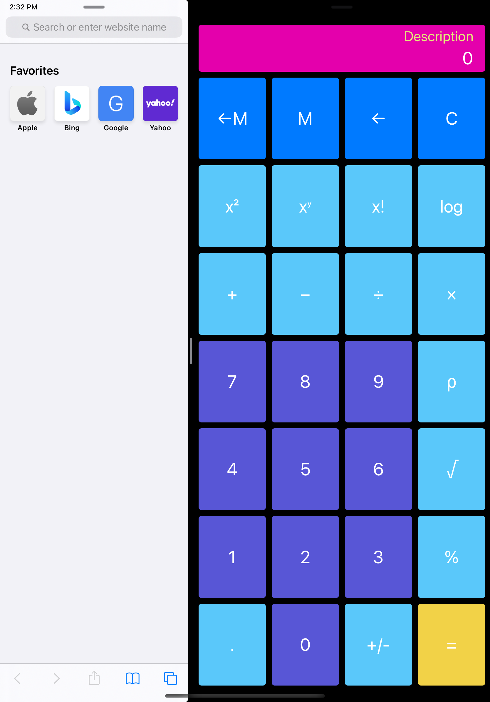

# Calculator
Calculator app is written in Swift. The app provides standard and scientific calculator functionality.

iPhone 12 Pro:
  

iPad Pro:

## Features
- Standard Calculator functionality which offers basic operations and evaluates commands immediately as they are entered.
- Scientific Calculator functionality which offers expanded operations and evaluates commands using order of operations.
- Calculation history and memory capabilities.
- Basic error description
